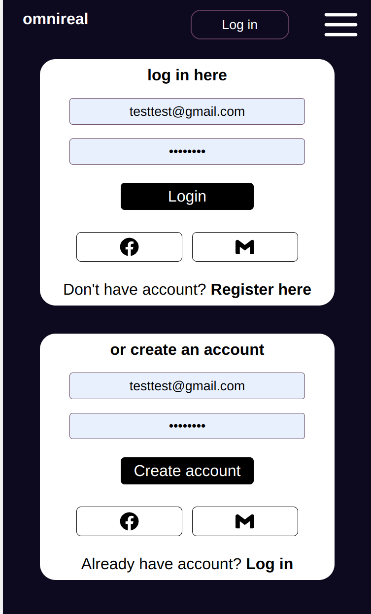

## Getting started
### `npm i `to install dependincies
### `npm run dev` to start

General exercise of react knowledge with:  
- Routing
- Login & logout with firebase authentication
- UseContext, useState, useEffect exercise

Screens: 

ToDo:
*media queries*, 
*shopping card*, 
*get started page edit*
